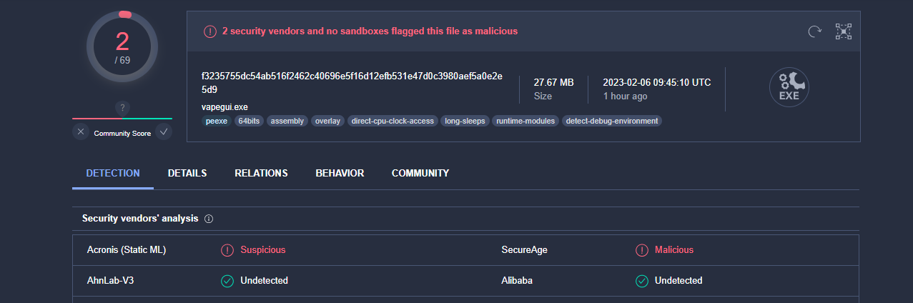
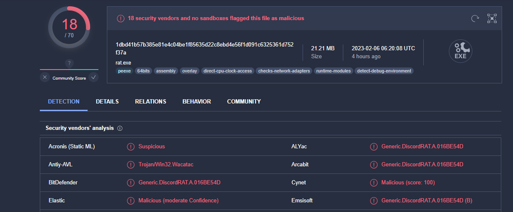

# Kerpy Bypass ✅

Kerpy is a tool designed to bypass VirusTotal detections, this project is in beta and will be improved!

## Before ❌



## After ✅



## Install ❗️

```
git clone https://github.com/Lawxsz/bypass-virus-total
pip3 install -r requeriments.txt
```
Run Kerpy in your script and you are done.

## IMPORTANT!
- I do not support any type of malicious activity with my code, nor take any responsability for any damage caused by it. Use at your own risk. 
- For learning purposes

## Note
- ⭐️ Give me a Star!! Kerpy is constantly updating, support us!
- The analysis was done with my grabber (+8 features), this without having obfuscated the source code (either with pyarmor etc), I recommend using Kerpy + obfuscate your code for best results.
- List of HWID/MAC/IP/GPU are from 6nz (thanks you) if anyone wants to provide more data like this, send me a message!
## Contact Me 💻

Telegram: @Lawxsz
Discord: Lawxsz#5963 (if not work, tell me in telegram)
